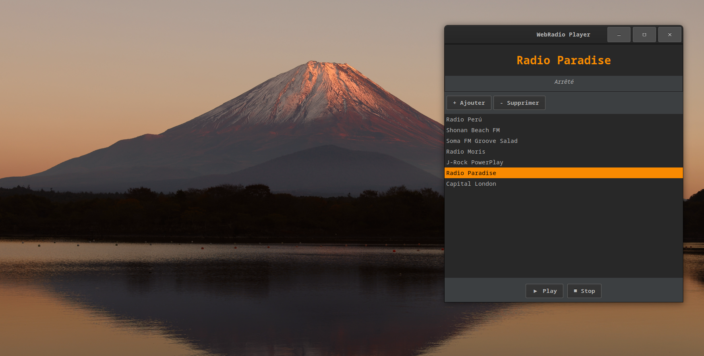

# Webradio_Julia



Lecteur webradio en Julia + GTK.

```bash
sudo apt install gstreamer1.0-tools libgtk-3-dev
git clone https://github.com/jclejeune/webradio_julia.git
cd webradio_julia
julia --project=. main.jl
```

## Fonctionnalités

- Interface Gtk
- Thème sombre
- Lecture audio avec GStreamer
- Play / Stop
- Ajout et suppression de radios
- Sauvegarde des radios en TOML
- Métadonnées ICY si disponibles
- Arrêt propre à la fermeture


## Structure
```
.
├── main.jl
├── Project.toml
├── Manifest.toml
├── resources
│   ├── radios.toml
│   └── screenshots
│       └── webradio-julia.png
└── src
    ├── audio_engine.jl
    ├── metadata.jl
    ├── persistence.jl
    ├── theme.jl
    ├── ui.jl
    └── webradio_julia.jl
```

